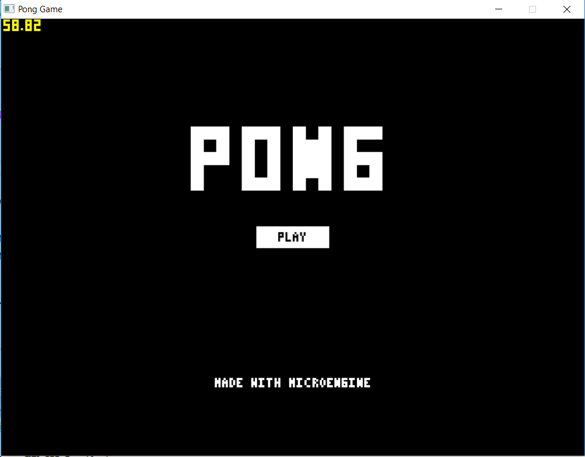

# Micro Engine
- simple 2d game engine written in C using SDL2.
- developed in msvc build tools windows.
- now in its early phase of development.
- currently available only for windows.

## Dependencies
- SDL2  : https://www.libsdl.org/download-2.0.php
- All binaries are available in the repo(msvc development libraries)

## Features
- Micro UI(immediate mode)
  - button
  - check box
  - text box
- Window management
- Event handling

## How to build
- run batch file build.bat
-Require cl (Microsoft visual C compiler) to be in the path variable
- if using different version of Microsoft Visual Studio change the version number in :
  call "C:\Program Files (x86)\Microsoft Visual Studio 14.0\VC\vcvarsall" x64

## Games developed
- #### Flappy bird

- #### Pong

- #### Pong main menu

